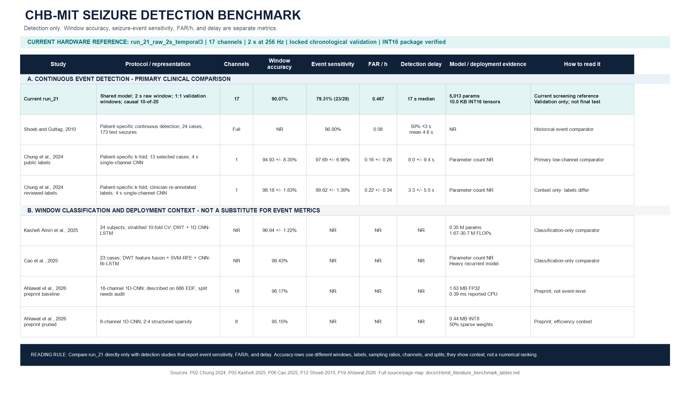

# CHB-MIT Literature Benchmark Tables

## Purpose and Rules

This file is the local, source-traceable benchmark sheet for papers that use
the CHB-MIT scalp EEG dataset. It is intentionally split by clinical task:

1. **Seizure prediction:** pre-ictal versus interictal classification before
   onset. `SEN`, `FPR/h`, and `SPH` are prediction metrics.
2. **Continuous seizure detection:** alarms against annotated ictal events.
   Event sensitivity, FAR/h, and latency are the clinically relevant metrics.
3. **Window classification:** ictal versus non-seizure labelled segments.
   Accuracy is meaningful only with the stated sampling and split.

Do not compare values across these tables as if they measure the same task.
`NR` means the value was not reported in the cited source. A `secondary`
source means the row was transcribed from a comparison table in a local review
paper, not from the original paper PDF. It is useful for landscape mapping but
must be checked in the original source before a final journal claim.

The current project is in the **continuous detection** track. Its 90.07%
number belongs only to the balanced-window table; it is not event sensitivity
and it is not a prediction result.

## A. Seizure Prediction on CHB-MIT

This reproduces and extends the structure of Zhang et al. Table IV. `SPH` is
the seizure-prediction horizon. `FPR/h` is the false-prediction rate per hour.

| Method | EEG source | Cases | Seizures | Input / features | Classifier | SEN (%) | FPR/h | SPH (min) | Accuracy (%) | Evidence |
|---|---|---:|---:|---|---|---:|---:|---:|---:|---|
| Zandi et al., 2013 | CHB-MIT | 3 | 18 | Zero crossings; similarity/dissimilarity index | NR | 83.81 | 0.165 | 40 | NR | Secondary: P01, p. 10 |
| Myers et al., 2016 | CHB-MIT | 10 | 31 | Phase/amplitude locking value | NR | 77.00 | 0.170 | 60 | NR | Secondary: P01, p. 10 |
| Khan et al., 2017 | CHB-MIT | NR | 131 | Wavelet transform | CNN | 87.80 | 0.140 | 10 | NR | Secondary: P01, p. 10 |
| Cho et al., 2017 | CHB-MIT | 21 | 65 | Phase-locking value | SVM | 82.44 | NR | 5 | NR | Secondary: P01, p. 10; also P08, p. 11 |
| Chu et al., 2017 | CHB-MIT | 13 | 125 | Fourier coefficients; PSD | NR | 83.81 | 0.165 | 86 | NR | Secondary: P01, p. 10 |
| Alotaiby et al., 2017 | CHB-MIT | 24 | 170 | Common-spatial-pattern statistics | LDA | 81.00 | 0.470 | 60 | NR | Secondary: P01, p. 10 |
| Truong et al., 2018 | CHB-MIT | 13 | 64 | STFT spectral images | CNN | 81.20 | 0.160 | 5 | NR | Secondary: P01, p. 10; also P08, p. 11 |
| Truong et al., 2018, GAN-CNN | CHB-MIT | 13 | NR | 28 s STFT; GAN discriminator features | CNN | NR | NR | Reported in protocol | NR; AUC 77.68 | Direct: P04, p. 4. Not directly comparable to event-SEN. |
| Zhang et al., 2020 | CHB-MIT | 23 | 156 | Wavelet packet + CSP statistics | Six-layer CNN | **92.20** | **0.120** | 30 | 90.00 | Direct: P01, pp. 9-10 |
| Ryu and Joe, 2021 | CHB-MIT | 24 | NR | DWT | DenseNet-LSTM | 92.92 | 0.063* | 5 pre-ictal length | 93.28 | Direct: P08, p. 11. *The paper labels this `FPR`; validate its time-unit definition before quoting as FAR/h. |
| Li et al., 2022 | CHB-MIT | 5 | NR | Frequency-domain preprocessing | Parallel 1D-CNN | 99.24 | 0.470 | NR | 99.01 | Direct: P09, pp. 8-10. Five-fold CV; not continuous event evaluation. |

**Prediction interpretation.** Zhang 2020 is the source of the image supplied
for this work. Its `90%` accuracy is pre-ictal/interictal trial accuracy under
its own patient-specific protocol; it must not be used as a target or direct
comparison for the present ictal detector.

## B. Continuous Seizure Detection on CHB-MIT

These rows report a seizure event metric and FAR/h. `Full` means at least 18
channels in Chung et al.'s comparison table, not necessarily the same montage.
The `Primary` rows are the closest external comparator set for the current
work. The current row is validation-only architecture screening, not final
held-out test evidence.

| Method | Channels | Cases / seizures | Input / model | Event SEN (%) | FAR/h | Delay (s) | Accuracy (%) | Evidence / comparability |
|---|---:|---|---|---:|---:|---:|---:|---|
| Shoeb and Guttag, 2010 | Full | 24 / 173 test seizures | Time series decomposed by DWT + SVM | 96.00 | 0.08 (about 2/day median) | 50% of events <3; mean 4.6 | NR | Primary; direct P12 and corroborated in P02, p. 9 |
| Xu et al. | Full | NR | Multiscale STFT + 3D-CNN | 94.95 | 0.08 | 2.3 | NR | Secondary: P02, p. 9 |
| Zhang et al. | Full | NR | DWT + Bi-GRU | 95.49 | 0.31 | NR | NR | Secondary: P02, p. 9 |
| Wang et al. | Full | NR | Multichannel time series + stacked 1D-CNN | 99.31 | 0.20 | 8.1 | NR | Secondary: P02, p. 9 |
| Li et al. | Full | NR | Multichannel time series + CNN-LSTM | 95.29 | 0.66 | NR | NR | Secondary: P02, p. 9 |
| Vidyaratne et al. | Full | NR | Fractal dimension + harmonic wavelet packet | Relevance-vector machine | 96.00 | 0.10 | 1.9 | NR | Secondary: P02, p. 9 |
| Tang et al. | 5 | NR | DWT + autoencoder frequency features | SVM | 97.20 | 0.64 | 1.1 | NR | Secondary: P02, p. 9 |
| Asif et al. | 10 | NR | Time-domain statistical features | RUSBoost | 92.00 | 0.21 | 7.1 | NR | Secondary: P02, p. 9. Full-channel variant: 95%, 0.16/h, 6.83 s. |
| Khanmohammadi et al. | 5 | NR | Time statistics + spectral power | Adaptive distance change-point detector | 96.00 | 0.12 | 4.2 | NR | Secondary: P02, p. 9 |
| Chung et al., 2024, public labels | 1, clinical per case | 13 selected cases | 4 s time series + parallel stacked 2D-CNN | **97.69 +/- 6.96** | **0.16 +/- 0.26** | 8.0 +/- 9.4 | 94.93 +/- 8.35 | Primary; direct P02, pp. 5, 7-8. Patient-specific k-fold. |
| Chung et al., 2024, reviewed labels | 1, clinical per case | 13 selected cases | 4 s time series + parallel stacked 2D-CNN | 99.62 +/- 1.39 | 0.22 +/- 0.34 | 3.3 +/- 5.5 | 98.18 +/- 1.83 | Context only: clinician re-annotations differ from public labels; direct P02, pp. 6, 8. |
| **Current `run_21_raw_2s_temporal3`** | **17** | **validation: 29 events** | **2 s raw window + compact separable 1D-CNN; causal 10-of-20 policy** | **79.31 (23/29)** | **0.4671** | **17 median** | **90.07 balanced-window** | Validation-only locked within-case chronological screening; not a final paper result. |

**Continuous-detection interpretation.** The current project meets its internal
screening limit of `FAR <= 0.5/h`, but does not yet match the external
patient-specific event-sensitivity and delay references. This is the real
clinical gap; no window accuracy can close it by itself.

## C. Window-Classification and Compactness Context

These are segment/window classification results. They are useful for comparing
representation and model cost, but lack a reported continuous alarm result
unless also listed in Table B. High accuracy here is not evidence of a low
clinical false-alarm rate.

| Method | CHB-MIT coverage / split | Representation and model | Accuracy (%) | Seizure SEN (%) | Model size / efficiency evidence | Evidence |
|---|---|---|---:|---:|---|---|
| Chung et al., 2024, public labels | 13 selected cases; patient-specific k-fold | Single-channel, 4 s; parallel stacked 2D-CNN | 94.93 +/- 8.35 | 96.39 +/- 2.75 | Not reported as a comparable parameter count | Direct: P02, pp. 5, 7-8 |
| Chung et al., 2024, reviewed labels | 13 selected cases; patient-specific k-fold | Single-channel, 4 s; parallel stacked 2D-CNN | 98.18 +/- 1.83 | 96.76 +/- 3.97 | Not reported as a comparable parameter count | Direct: P02, pp. 5-6, 8 |
| Kashefi Amiri et al., 2025 | 24 subjects; stratified 10-fold CV | Per-channel DWT + 1D CNN-LSTM | 96.94 +/- 1.22 | 92.21 +/- 1.17 | 0.35 M parameters; 1.67e6 to 3.07e7 FLOPs | Direct: P05, pp. 12, 14 |
| Cao et al., 2025 | 23 cases | DWT feature fusion + SVM-RFE + CNN-Bi-LSTM | 98.43 | 97.84 | Heavy recurrent/feature-engineered comparator; parameter count NR | Direct: P06, pp. 20-23 |
| Alharthi et al., 2022 | 23 subjects; integrated CHB-MIT + KAU protocol | 18-channel 1D-CNN + Bi-LSTM + attention | 96.87 | 96.85 | Converges around 130 epochs; parameter count NR | Direct: P07, p. 15. Not CHB-MIT-only. |
| Ahlawat et al., 2026 preprint | 18 channels; protocol described on 686 EDF | Baseline 1D-CNN | 96.17 | NR | 1.63 MB FP32; 0.39 ms reported CPU latency | Direct: P19, pp. 2-3, 7. Preprint; split details must be checked. |
| Ahlawat et al., 2026 preprint | 8 channels; 2:4 sparse | Pruned 1D-CNN | 95.15 | NR | 50% sparse weights; 55% channel reduction | Direct: P19, p. 7. Preprint; not event-level. |
| Chen et al., 2026 | Pareto channel/frequency configurations | Channel-frequency selection | 82.17 to 99.83 | NR | 1 to 8 selected channels and 1 to 12 bands | Direct: P30, p. 4. Classification setting; details/split must be checked. |
| **Current `run_21_raw_2s_temporal3`, FP32** | **17 channels; locked within-case chronological validation; 1:1 windows** | **Raw 2 s separable 1D-CNN** | **90.0718** | **90.7645** | **5,013 parameters; 28,130 B checkpoint** | Reproducible local result: `results/reference/run_21_raw_2s_temporal3/validation_summary.json` |
| **Current `run_21_raw_2s_temporal3`, INT16 emulation** | **Same validation windows** | **BatchNorm-folded signed-INT16 tensor package** | **90.0462** | **90.7645** | **10,030 B tensors; 99.9743% FP32/INT16 agreement** | Reproducible local result: `fpga/reference_run_21_int16/quantization_report.json` |

## D. How This Benchmark Must Be Used

- Use Table A only if this repository later implements an independently
  specified pre-ictal prediction protocol.
- Use Table B to select and report clinically meaningful detection candidates:
  event sensitivity, FAR/h, and delay must always appear together.
- Use Table C to report `accuracy` and deployment efficiency, with the
  sampling ratio, window length, channel count, and validation protocol.
- `run_21` is the compact accuracy and fixed-point reference, not proof that it
  outperforms any paper. Its next candidate must exceed 79.31% validation
  event sensitivity while retaining FAR <= 0.5/h and median delay <=17 s.
- Before submission, verify every `secondary` row from its original paper and
  add a patient-held-out final protocol with confidence intervals.

## Local Source Map

| ID | Local PDF | Pages used |
|---|---|---|
| P01 | [`01_zhang_2020_csp_cnn_seizure_prediction.pdf`](papers_chbmit/01_zhang_2020_csp_cnn_seizure_prediction.pdf) | 9-10 |
| P02 | [`02_chung_2024_single_channel_chbmit_detection.pdf`](papers_chbmit/02_chung_2024_single_channel_chbmit_detection.pdf) | 5-10 |
| P04 | [`04_truong_2018_semisupervised_gan_prediction.pdf`](papers_chbmit/04_truong_2018_semisupervised_gan_prediction.pdf) | 4 |
| P05 | [`05_kashefi_2025_dwt_1dcnn_lstm_detection.pdf`](papers_chbmit/05_kashefi_2025_dwt_1dcnn_lstm_detection.pdf) | 12, 14 |
| P06 | [`06_cao_2025_feature_fusion_cnn_bilstm_detection.pdf`](papers_chbmit/06_cao_2025_feature_fusion_cnn_bilstm_detection.pdf) | 20-23 |
| P07 | [`07_alharthi_2022_epileptic_disorder_detection.pdf`](papers_chbmit/07_alharthi_2022_epileptic_disorder_detection.pdf) | 13, 15 |
| P08 | [`08_ryu_2021_densenet_lstm_prediction.pdf`](papers_chbmit/08_ryu_2021_densenet_lstm_prediction.pdf) | 9-11 |
| P09 | [`09_li_2022_parallel_memristive_cnn_detection_prediction.pdf`](papers_chbmit/09_li_2022_parallel_memristive_cnn_detection_prediction.pdf) | 8-10 |
| P12 | [`12_shoeb_guttag_2010_ml_seizure_detection_icml.pdf`](papers_chbmit/12_shoeb_guttag_2010_ml_seizure_detection_icml.pdf) | 6-8 |
| P19 | [`19_ahlawat_2026_int8_quant_channel_pruning_snn.pdf`](papers_chbmit/19_ahlawat_2026_int8_quant_channel_pruning_snn.pdf) | 2-3, 7 |
| P30 | [`30_frontiers_2026_channel_frequency_selection_chbmit.pdf`](papers_chbmit/30_frontiers_2026_channel_frequency_selection_chbmit.pdf) | 4 |

The higher-level interpretation and the current protocol contract remain in
[`paper_benchmark_comparison.md`](paper_benchmark_comparison.md) and
[`benchmark_definition_and_comparability.md`](benchmark_definition_and_comparability.md).

## Visual Summary



Regenerate this image after changing its source values with:

```powershell
powershell -ExecutionPolicy Bypass -File AI_train_model/scripts/render_chbmit_benchmark_table.ps1
```
